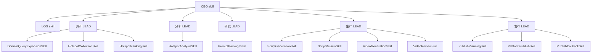

# CEO / LOG / LEAD / SKILL 五段式分层确认稿

## 1. 目标

按当前项目实际需求，系统 skill 划分确认如下：

1. `CEO skill` 负责全局统筹
2. `LOG skill` 负责全程记录
3. `LEAD skill` 负责业务分段承接
4. `SKILL` 负责单点执行

其中 `LEAD skill` 固定为 5 个：

- 调研 LEAD
- 分析 LEAD
- 研发 LEAD
- 生产 LEAD
- 发布 LEAD

## 2. 最终确认的结构

```text
CEO skill
  ├─ LOG skill
  ├─ 调研 LEAD
  │   ├─ DomainQueryExpansionSkill
  │   ├─ HotspotCollectionSkill
  │   └─ HotspotRankingSkill
  ├─ 分析 LEAD
  │   └─ HotspotAnalysisSkill
  ├─ 研发 LEAD
  │   └─ PromptPackageSkill
  ├─ 生产 LEAD
  │   ├─ ScriptGenerationSkill
  │   ├─ ScriptReviewSkill
  │   ├─ VideoGenerationSkill
  │   └─ VideoReviewSkill
  └─ 发布 LEAD
      ├─ PublishPlanningSkill
      ├─ PlatformPublishSkill
      └─ PublishCallbackSkill
```

### 调度图



## 3. 各层职责

### 3.1 CEO skill

CEO skill 是总控层。

主要职责：

- 接收完整业务目标
- 判断当前要跑哪条业务链
- 拆分并派发到 5 个 LEAD
- 管理依赖顺序和异常升级
- 汇总所有 LEAD 的输出

### 3.2 LOG skill

LOG skill 是横切层。

主要职责：

- 记录 workflow 开始、结束、失败
- 记录每个 LEAD / SKILL 的输入输出
- 记录耗时、错误、trace 信息
- 为回放、审计、验收提供依据

### 3.3 调研 LEAD

调研 LEAD 负责“从平台拿到热点视频”。

主要职责：

- 将领域转换为可搜索词
- 从主要平台采集热点视频
- 去重、筛选、排序热点
- 输出热点池给分析 LEAD

对应 leaf skill：

- `DomainQueryExpansionSkill`
- `HotspotCollectionSkill`
- `HotspotRankingSkill`

### 3.4 分析 LEAD

分析 LEAD 负责“分析爆款基因”。

主要职责：

- 解析热点内容的结构
- 提取爆款基因、钩子、镜头、风险点
- 输出分析报告和可复用元素

对应 leaf skill：

- `HotspotAnalysisSkill`

### 3.5 研发 LEAD

研发 LEAD 负责“提示词生产”。

主要职责：

- 接收分析结果
- 生成 prompt package
- 输出脚本主题、标题候选、视频提示词

对应 leaf skill：

- `PromptPackageSkill`

### 3.6 生产 LEAD

生产 LEAD 负责“产生视频”。

主要职责：

- 接收研发结果
- 生成脚本草稿
- 处理脚本审核
- 生成视频任务
- 处理视频审核

对应 leaf skill：

- `ScriptGenerationSkill`
- `ScriptReviewSkill`
- `VideoGenerationSkill`
- `VideoReviewSkill`

### 3.7 发布 LEAD

发布 LEAD 负责“向不同平台发布视频”。

主要职责：

- 接收视频成品
- 生成发布计划
- 适配不同平台发布策略
- 处理发布回调和状态同步

对应 leaf skill：

- `PublishPlanningSkill`
- `PlatformPublishSkill`
- `PublishCallbackSkill`

### 3.8 LEAD 的职责边界

LEAD skill 不是单纯的调度器，而是上游与下游之间的业务翻译层。
每个 LEAD 都应同时满足三件事：

- 读懂上游输入，形成自己可处理的 bundle
- 统筹本组 leaf skill 的内部调度
- 输出下游可直接消费的 bundle

即使只有一个 leaf skill，接口也必须完整：

- 输入是什么
- 要处理什么
- 输出给谁
- 失败怎么办
- 如何记录与验收

## 4. 固定 skill 数量

按当前项目实际需求，建议确认如下固定数量：

- `1` 个 `CEO skill`
- `1` 个 `LOG skill`
- `5` 个 `LEAD skill`
- `12` 个叶子 `SKILL`

### 叶子 SKILL 清单

1. `DomainQueryExpansionSkill`
2. `HotspotCollectionSkill`
3. `HotspotRankingSkill`
4. `HotspotAnalysisSkill`
5. `PromptPackageSkill`
6. `ScriptGenerationSkill`
7. `ScriptReviewSkill`
8. `VideoGenerationSkill`
9. `VideoReviewSkill`
10. `PublishPlanningSkill`
11. `PlatformPublishSkill`
12. `PublishCallbackSkill`

## 5. 文件目录结构

叶子 skill 必须按所属 LEAD 分目录，不允许全部平放到单一目录。

```text
src/app/skills/
|-- ceo/
|   `-- workflow_ceo.py
|-- log/
|   `-- workflow_log.py
|-- lead/
|   |-- research/
|   |   |-- __init__.py
|   |   |-- domain_query_expansion.py
|   |   |-- hotspot_collection.py
|   |   `-- hotspot_ranking.py
|   |-- analysis/
|   |   |-- __init__.py
|   |   `-- hotspot_analysis.py
|   |-- research_development/
|   |   |-- __init__.py
|   |   `-- prompt_package.py
|   |-- production/
|   |   |-- __init__.py
|   |   |-- script_generation.py
|   |   |-- script_review.py
|   |   |-- video_generation.py
|   |   `-- video_review.py
|   `-- publish/
|       |-- __init__.py
|       |-- publish_planning.py
|       |-- platform_publish.py
|       `-- publish_callback.py
`-- registry.py
```

## 6. 当前代码映射

| 现有代码 | 目标层级 |
|---|---|
| `src/app/services/workflow.py` | `CEO skill` |
| `src/app/services/workflow_runs.py` | `LOG skill` |
| `src/app/services/trend_intelligence.py` | `调研 LEAD` / `研发 LEAD` |
| `src/app/services/hotspot.py` | `调研 LEAD` |
| `src/app/services/analysis.py` | `分析 LEAD` |
| `src/app/services/script.py` | `生产 LEAD` |
| `src/app/services/video.py` | `生产 LEAD` |
| `src/app/services/publish.py` | `发布 LEAD`（未来新增） |

## 7. 结论

当前系统的 skill 划分，建议正式确认成：

```text
CEO -> LOG -> 调研 LEAD -> 分析 LEAD -> 研发 LEAD -> 生产 LEAD -> 发布 LEAD
```

这套划分和当前项目的真实业务链路是对齐的，可以作为后续开发的唯一文档基准。
