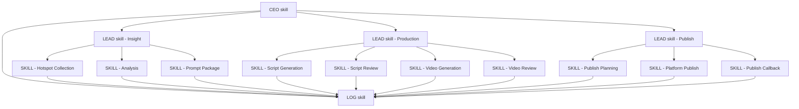

# CEO / LOG / LEAD / SKILL 四级分层设计

> 说明：本文已被新的正式确认稿替代，请以 [skill_CEO_LOG_LEAD_SKILL_五段式分层确认稿.md](E:/2026OPC大赛/龙虾流程/doc/skill_CEO_LOG_LEAD_SKILL_五段式分层确认稿.md) 为准。

## 1. 设计目标

把系统的执行方式从“函数串联”升级为“分层调度”：

1. `CEO skill` 负责全局指挥
2. `LOG skill` 负责全程记录
3. `LEAD skill` 负责承上启下、组内调度
4. `SKILL` 负责单点业务执行

核心原则：

- 每层只做自己该做的事
- 上游只依赖下游的稳定输出，不依赖内部实现
- 任何 skill 都必须有完整接口，即使它目前只有一个动作

## 2. 分层关系

```text
CEO skill
  ├─ LOG skill
  ├─ LEAD skill A
  │   ├─ SKILL 1
  │   ├─ SKILL 2
  │   └─ SKILL 3
  ├─ LEAD skill B
      ├─ SKILL 4
      ├─ SKILL 5
      └─ SKILL 6
  └─ LEAD skill C
      ├─ SKILL 7
      ├─ SKILL 8
      └─ SKILL 9
```

### 调度图



## 3. 各层主要功能

### 3.1 CEO skill

CEO skill 是全局总控层，负责“任务从哪里来、要去哪里、什么时候完成”。

主要功能：

- 接收完整业务目标
- 将目标拆成多个 LEAD 级任务
- 决定执行顺序和路由策略
- 统一处理失败升级、重试、终止
- 汇总最终输出给调用方

分析：

- 它不是业务执行者
- 它看的是全局，不看单点细节
- 它负责把“项目目标”翻译成“分工任务”

### 3.2 LOG skill

LOG skill 是横切层，负责流程留痕和状态账本。

主要功能：

- 记录 workflow 开始 / 结束 / 失败
- 记录 LEAD 和 SKILL 的输入、输出、状态
- 记录 trace_id、耗时、错误信息、关键中间产物
- 为回放、排障、审计、验收提供证据

分析：

- 它不参与决策
- 它只记录，不解释
- 它是整个系统的“黑匣子”

### 3.3 LEAD skill

LEAD skill 是中层管理者，负责“理解上游输入”和“交付下游输出”。

主要功能：

- 接收 CEO 下发的子目标
- 把抽象任务翻译成组内可执行任务
- 调度本组内的多个 SKILL
- 汇总本组结果，整理成稳定输出
- 屏蔽组内实现变化，保证对上对下接口稳定

分析：

- LEAD skill 的价值不只是调度
- 它更重要的是语义转换和输出整形
- 即使组内只有一个 SKILL，它也应保留完整的输入输出契约

### 3.4 SKILL

SKILL 是叶子层，负责单一业务动作。

主要功能：

- 校验输入
- 执行一个明确动作
- 输出稳定结构化结果
- 失败时返回明确错误

分析：

- SKILL 不再向下拆分
- SKILL 不处理流程编排
- SKILL 必须是可替换、可复用、可单独验收的

### 3.5 Publish LEAD

Publish LEAD 是发布阶段的中层管理者，负责把视频成品交付到不同平台。

主要功能：

- 接收已完成的视频结果
- 判断发布目标平台和发布时间
- 调度平台发布、确认、回调与状态同步
- 屏蔽抖音、小红书、B站的接口差异
- 输出发布结果与发布记录

分析：

- 发布是独立链路，不应塞进 Production LEAD
- 它有自己的平台差异和状态回流
- 它更接近“交付”而不是“生产”

## 4. 目录草图

```text
src/app/
|-- skills/
|   |-- __init__.py
|   |-- base.py
|   |-- context.py
|   |-- result.py
|   |-- ceo/
|   |   |-- __init__.py
|   |   `-- workflow_ceo.py
|   |-- log/
|   |   |-- __init__.py
|   |   |-- workflow_log.py
|   |   `-- step_log.py
|   |-- lead/
|   |   |-- __init__.py
|   |   |-- insight_lead.py
|   |   `-- production_lead.py
|   |-- skill/
|   |   |-- __init__.py
|   |   |-- hotspot_collection.py
|   |   |-- analysis.py
|   |   |-- prompt_package.py
|   |   |-- script_generation.py
|   |   |-- script_review.py
|   |   |-- video_generation.py
|   |   `-- video_review.py
|   `-- registry.py
`-- services/
```

## 5. 接口草图

### 5.1 通用上下文与结果

```python
from dataclasses import dataclass, field
from typing import Any

@dataclass
class SkillContext:
    workflow_run_id: str | None
    trace_id: str | None
    parent_skill: str | None = None
    metadata: dict[str, Any] = field(default_factory=dict)

@dataclass
class SkillResult:
    ok: bool
    output: dict[str, Any] = field(default_factory=dict)
    refs: dict[str, Any] = field(default_factory=dict)
    notes: list[str] = field(default_factory=list)
    error_message: str | None = None
```

### 5.2 CEO skill

```python
class BaseCEO:
    async def plan(self, payload: dict[str, Any]) -> dict[str, Any]:
        ...

    async def dispatch(self, plan: dict[str, Any], ctx: SkillContext) -> dict[str, Any]:
        ...

    async def collect(self, results: dict[str, Any], ctx: SkillContext) -> dict[str, Any]:
        ...

    async def finish(self, result: dict[str, Any], ctx: SkillContext) -> dict[str, Any]:
        ...
```

### 5.3 LOG skill

```python
class BaseLOG:
    async def start_run(self, workflow_type: str, payload: dict[str, Any]) -> str:
        ...

    async def start_step(self, run_id: str, step_name: str, payload: dict[str, Any]) -> str:
        ...

    async def finish_step(self, step_id: str, output: dict[str, Any]) -> None:
        ...

    async def fail_step(self, step_id: str, error_message: str) -> None:
        ...

    async def finish_run(self, run_id: str, result: dict[str, Any]) -> None:
        ...
```

### 5.4 LEAD skill

```python
class BaseLEAD:
    async def accept(self, payload: dict[str, Any], ctx: SkillContext) -> bool:
        ...

    async def normalize_input(self, payload: dict[str, Any], ctx: SkillContext) -> dict[str, Any]:
        ...

    async def build_plan(self, payload: dict[str, Any], ctx: SkillContext) -> dict[str, Any]:
        ...

    async def dispatch(self, plan: dict[str, Any], ctx: SkillContext) -> dict[str, Any]:
        ...

    async def merge_output(self, outputs: dict[str, Any], ctx: SkillContext) -> dict[str, Any]:
        ...
```

### 5.5 SKILL

```python
class BaseSkill:
    name: str

    async def accept(self, payload: dict[str, Any], ctx: SkillContext) -> bool:
        ...

    async def normalize_input(self, payload: dict[str, Any], ctx: SkillContext) -> dict[str, Any]:
        ...

    async def run(self, payload: dict[str, Any], ctx: SkillContext) -> SkillResult:
        ...

    async def build_output(self, result: SkillResult, ctx: SkillContext) -> dict[str, Any]:
        ...
```

## 6. 当前系统映射

现有代码可以先对应成：

| 现有代码 | 目标层级 |
|---|---|
| `src/app/services/workflow.py` | `CEO skill` |
| `src/app/services/workflow_runs.py` | `LOG skill` |
| `src/app/services/hotspot.py` + `trend_intelligence.py` | `LEAD skill` + `SKILL` |
| `src/app/services/analysis.py` | `SKILL` |
| `src/app/services/script.py` | `SKILL` |
| `src/app/services/video.py` | `SKILL` |
| `src/app/services/publish.py` | `Publish LEAD` + `SKILL`（未来新增） |

## 7. 关键设计结论

1. `CEO skill` 必须存在，且只负责总控。
2. `LOG skill` 必须独立出来，不能混在业务逻辑里。
3. `LEAD skill` 不只是调度器，更是语义承接层和输出整形层。
4. `SKILL` 即使只有一个动作，也必须有完整契约。
5. 上游和下游只能依赖稳定输出字段，不能依赖内部代码结构。

## 8. 推荐落地顺序

1. 先落 `LOG skill`
2. 再落 `CEO skill`
3. 然后拆 `LEAD skill`
4. 最后把现有业务 service 逐个包成 `SKILL`

## 9. 当前项目的固定分解清单

### 9.1 建议的固定数量

按当前项目实际需求，建议先固定为：

- `1` 个 `CEO skill`
- `1` 个 `LOG skill`
- `3` 个 `LEAD skill`
- `12` 个叶子 `SKILL`

### 9.2 叶子 SKILL 明细

#### Insight LEAD 下的 5 个 SKILL

1. `DomainQueryExpansionSkill`
   - 输入：领域、受众、发布目标
   - 输出：扩展查询词
   - 作用：把抽象领域翻译成可搜索词

2. `HotspotCollectionSkill`
   - 输入：查询词、平台、数量
   - 输出：热点列表
   - 作用：收集并去重热点内容

3. `HotspotRankingSkill`
   - 输入：热点列表
   - 输出：排序结果、top_n 结果
   - 作用：筛出最有价值的热点

4. `AnalysisSkill`
   - 输入：热点
   - 输出：分析报告
   - 作用：提取框架、结构、钩子、风险

5. `PromptPackageSkill`
   - 输入：热点、分析报告、风格、内容类型
   - 输出：提示词包
   - 作用：把上游素材整形成下游可用的内容生产输入

#### Production LEAD 下的 4 个 SKILL

6. `ScriptGenerationSkill`
   - 输入：分析报告、提示词包、风格、时长
   - 输出：脚本草稿
   - 作用：生成原创脚本

7. `ScriptReviewSkill`
   - 输入：脚本、审核意见
   - 输出：审核状态
   - 作用：决定脚本是否进入视频生产

8. `VideoGenerationSkill`
   - 输入：通过审核的脚本、视频风格
   - 输出：视频任务、视频地址
   - 作用：生成视频并存储

9. `VideoReviewSkill`
   - 输入：视频任务、审核意见
   - 输出：视频审核结果
   - 作用：完成最终质检与归档

#### Publish LEAD 下的 3 个 SKILL

10. `PublishPlanningSkill`
    - 输入：视频成品、平台、发布时间
    - 输出：发布计划
    - 作用：确定发布策略与执行窗口

11. `PlatformPublishSkill`
    - 输入：发布计划、平台账号
    - 输出：发布结果
    - 作用：执行不同平台的视频发布

12. `PublishCallbackSkill`
    - 输入：平台回调、发布任务
    - 输出：发布状态
    - 作用：接收平台状态变化并同步系统记录

### 9.3 CEO skill 的固定任务

CEO skill 不是做业务动作，而是做全局分解与统筹，固定任务如下：

1. 接收项目目标
2. 识别当前请求属于哪个业务链路
3. 拆分成 `Insight LEAD`、`Production LEAD`、`Publish LEAD` 三条线
4. 设定执行顺序和依赖关系
5. 统一接收各 LEAD 的输出
6. 汇总最终结果给调用方
7. 遇到异常时决定重试、跳过或终止

### 9.4 LEAD skill 的固定任务

#### Insight LEAD

- 理解领域输入
- 把领域变成查询词
- 调度热点采集、排序、分析
- 组织提示词包输出
- 输出 `insight_bundle`

#### Production LEAD

- 接收 `insight_bundle`
- 调度脚本与视频生产
- 管理审核节点
- 输出 `production_bundle`

#### Publish LEAD

- 接收 `production_bundle`
- 生成发布计划
- 调度平台发布、确认与回调
- 处理不同平台的差异
- 输出 `publish_bundle`

#### Publish LEAD

- 接收 `production_bundle`
- 生成发布计划
- 调度各平台发布动作
- 处理发布确认与回调
- 输出 `publish_bundle`

### 9.5 结论

如果按当前项目实际需求来固定，最适合的不是“无限拆 skill”，而是：

```text
1 CEO
1 LOG
3 LEAD
12 SKILL
```

这个数量既能覆盖当前 MVP，又能保留后续扩展空间。
