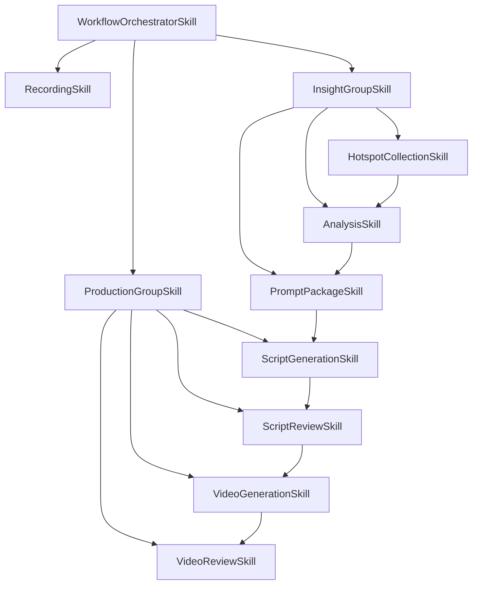

# Skill 功能划分与接口草图

> 说明：本文为早期草图，正式确认请以 [skill_CEO_LOG_LEAD_SKILL_五段式分层确认稿.md](E:/2026OPC大赛/龙虾流程/doc/skill_CEO_LOG_LEAD_SKILL_五段式分层确认稿.md) 为准。

## 1. 分层原则

系统建议拆成三层：

1. 业务 skill  
   负责具体业务动作，只做一件事。
2. 记录 skill  
   负责记录每个 skill 的开始、结束、输入、输出、失败原因。
3. workflow 编排  
   负责按顺序调用业务 skill，并把状态交给记录 skill。

## 2. 目录草图

```text
src/app/
|-- skills/
|   |-- __init__.py
|   |-- base.py
|   |-- context.py
|   |-- result.py
|   |-- business/
|   |   |-- __init__.py
|   |   |-- hotspot_collection.py
|   |   |-- analysis.py
|   |   |-- prompt_package.py
|   |   |-- script_generation.py
|   |   |-- script_review.py
|   |   |-- video_generation.py
|   |   `-- video_review.py
|   |-- recording/
|   |   |-- __init__.py
|   |   |-- tracker.py
|   |   `-- step_logger.py
|   `-- workflows/
|       |-- __init__.py
|       |-- domain_auto_run.py
|       `-- registry.py
|-- api/
|-- models/
|-- schemas/
`-- services/
```

## 3. 职责划分

### 3.1 业务 skill

每个 skill 只处理一个明确阶段。

| Skill | 输入 | 输出 | 完成标准 |
|---|---|---|---|
| `HotspotCollectionSkill` | `domain`, `platform`, `count` | `hotspot_ids`, `hotspot_snapshot` | 成功采集并去重 |
| `AnalysisSkill` | `hotspot_ids` | `analysis_ids` | 每个热点生成分析结果 |
| `PromptPackageSkill` | `hotspot_ids`, `analysis_ids` | `prompt_package` | 生成主题、关键词、提示词包 |
| `ScriptGenerationSkill` | `analysis_id`, `prompt_package`, `style`, `duration` | `script_id` | 生成脚本草稿 |
| `ScriptReviewSkill` | `script_id`, `approved`, `feedback` | `script_status` | 脚本进入 approved/rejected |
| `VideoGenerationSkill` | `approved script_id`, `style` | `video_task_id`, `video_url` | 视频任务完成 |
| `VideoReviewSkill` | `video_task_id`, `approved`, `feedback` | `review_record_id` | 审核结果落库 |

### 3.2 记录 skill

记录 skill 只做流程留痕，不做业务判断。

| Skill | 职责 | 记录内容 |
|---|---|---|
| `WorkflowTrackerSkill` | 记录一次 workflow 的生命周期 | `workflow_run_id`, `workflow_type`, `status`, `input_payload`, `result_payload`, `error_message` |
| `StepLoggerSkill` | 记录单个 step 的执行过程 | `step_name`, `step_status`, `step_input`, `step_output`, `started_at`, `completed_at` |

## 4. 接口草图

### 4.1 通用数据结构

```python
from dataclasses import dataclass, field
from typing import Any

@dataclass
class SkillContext:
    workflow_run_id: str | None
    trace_id: str | None
    actor: str | None = None
    metadata: dict[str, Any] = field(default_factory=dict)

@dataclass
class SkillResult:
    ok: bool
    output: dict[str, Any] = field(default_factory=dict)
    refs: dict[str, Any] = field(default_factory=dict)
    notes: list[str] = field(default_factory=list)
    error_message: str | None = None
```

### 4.2 业务 skill 基类

```python
from abc import ABC, abstractmethod
from typing import Any

class BaseSkill(ABC):
    name: str

    @abstractmethod
    async def run(self, payload: dict[str, Any], ctx: SkillContext) -> SkillResult:
        ...
```

### 4.3 记录 skill 接口

```python
class WorkflowTrackerSkill:
    async def start_run(self, workflow_type: str, payload: dict[str, Any]) -> str:
        ...

    async def finish_run(self, workflow_run_id: str, result: dict[str, Any]) -> None:
        ...

    async def fail_run(self, workflow_run_id: str, error_message: str) -> None:
        ...

class StepLoggerSkill:
    async def start_step(self, workflow_run_id: str, step_name: str, payload: dict[str, Any]) -> str:
        ...

    async def finish_step(self, step_id: str, output: dict[str, Any]) -> None:
        ...

    async def fail_step(self, step_id: str, error_message: str) -> None:
        ...
```

### 4.4 workflow 编排接口

```python
class DomainAutoRunWorkflow:
    async def run(self, payload: dict[str, Any]) -> dict[str, Any]:
        ...

    async def resume(self, workflow_run_id: str) -> dict[str, Any]:
        ...

    async def get_status(self, workflow_run_id: str) -> dict[str, Any]:
        ...
```

## 5. 执行链路

```text
DomainAutoRunWorkflow
  -> WorkflowTrackerSkill.start_run()
  -> StepLoggerSkill.start_step(hotspot)
  -> HotspotCollectionSkill.run()
  -> StepLoggerSkill.finish_step()
  -> StepLoggerSkill.start_step(analysis)
  -> AnalysisSkill.run()
  -> StepLoggerSkill.finish_step()
  -> StepLoggerSkill.start_step(prompt_package)
  -> PromptPackageSkill.run()
  -> StepLoggerSkill.finish_step()
  -> StepLoggerSkill.start_step(script)
  -> ScriptGenerationSkill.run()
  -> StepLoggerSkill.finish_step()
  -> optional review / video skills
  -> WorkflowTrackerSkill.finish_run()
```

## 6. 当前代码映射

现有实现可以先按下面映射：

| 现有代码 | 未来 skill |
|---|---|
| `src/app/services/hotspot.py` | `HotspotCollectionSkill` |
| `src/app/services/analysis.py` | `AnalysisSkill` |
| `src/app/services/trend_intelligence.py` | `PromptPackageSkill` |
| `src/app/services/script.py` | `ScriptGenerationSkill` / `ScriptReviewSkill` |
| `src/app/services/video.py` | `VideoGenerationSkill` / `VideoReviewSkill` |
| `src/app/services/workflow_runs.py` | `WorkflowTrackerSkill` + `StepLoggerSkill` 的持久化后端 |
| `src/app/services/workflow.py` | `DomainAutoRunWorkflow` |

## 7. 推荐落地顺序

1. 先补 `recording` 层
2. 再把 `workflow.py` 拆成编排器
3. 最后把热点、分析、脚本、视频逐个包成业务 skill

这样可以保证：

- 现有 API 不需要一次性大改
- 中间状态能被统一记录
- 每个阶段都能独立验收

## 8. Skill 关系划分调度图

### 8.1 分层关系

```text
WorkflowOrchestratorSkill
  ├─ RecordingSkill
  ├─ InsightGroupSkill
  │   ├─ HotspotCollectionSkill
  │   ├─ AnalysisSkill
  │   └─ PromptPackageSkill
  └─ ProductionGroupSkill
      ├─ ScriptGenerationSkill
      ├─ ScriptReviewSkill
      ├─ VideoGenerationSkill
      └─ VideoReviewSkill
```

### 8.2 调度图



### 8.3 调度规则

1. 总控 skill 只做全局拆解、路由、汇总。
2. 小组 skill 负责理解上游输入，并生成组内可执行任务。
3. 叶子 skill 只做单一业务动作，不再继续拆分。
4. 记录 skill 横切所有层级，只记录，不决策。
5. 每个 skill 都必须返回稳定输出，哪怕只有一个叶子节点，也不能是松散脚本式返回。
6. 下游 skill 只能消费上游约定好的输出字段，不直接依赖内部实现细节。

### 8.4 推荐的输入输出链

```text
domain input
  -> workflow payload
  -> InsightGroupSkill
  -> hotspot bundle
  -> analysis bundle
  -> prompt package
  -> ProductionGroupSkill
  -> script bundle
  -> video bundle
  -> final workflow result
```
