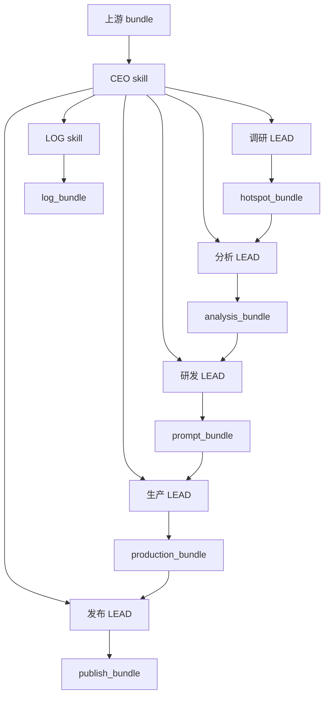

# skill 目录与接口草图

## 1. 目标

把当前系统整理成可落地的 skill 目录与接口边界：

- `CEO skill` 只负责全局调度
- `LOG skill` 只负责记录、回放、验收
- `LEAD skill` 只负责承接上游 bundle，并统筹本组 leaf skill
- `leaf skill` 只负责单点业务执行

## 2. 目录草图

```text
src/app/skills/
|-- ceo/
|   `-- workflow_ceo.py
|-- log/
|   `-- workflow_log.py
|-- lead/
|   |-- research/
|   |   |-- __init__.py
|   |   |-- domain_query_expansion.py
|   |   |-- hotspot_collection.py
|   |   |-- hotspot_dedup.py
|   |   |-- hotspot_ranking.py
|   |   `-- hotspot_snapshot.py
|   |-- analysis/
|   |   |-- __init__.py
|   |   |-- hotspot_structure.py
|   |   |-- hook_extraction.py
|   |   |-- emotion_curve.py
|   |   |-- risk_extraction.py
|   |   |-- reusable_element.py
|   |   `-- analysis_persist.py
|   |-- research_development/
|   |   |-- __init__.py
|   |   |-- prompt_package.py
|   |   |-- title_candidate.py
|   |   |-- prompt_validation.py
|   |   `-- prompt_version.py
|   |-- production/
|   |   |-- __init__.py
|   |   |-- script_draft.py
|   |   |-- script_review.py
|   |   |-- video_task.py
|   |   |-- video_process.py
|   |   |-- video_review.py
|   |   |-- asset_storage.py
|   |   `-- retry_recovery.py
|   `-- publish/
|       |-- __init__.py
|       |-- publish_plan.py
|       |-- platform_adapter.py
|       |-- publish_execute.py
|       |-- publish_callback.py
|       |-- publish_history.py
|       `-- retry_recovery.py
`-- registry.py
```

## 3. LEAD 职责边界

每个 `LEAD` 都必须同时完成三件事：

1. 理解上游输入，转成自己能处理的 bundle
2. 调度组内 leaf skill
3. 输出下游可直接消费的 bundle

即使只有一个 leaf skill，LEAD 也不能只写“转发”，必须定义完整输入、处理、输出、失败与记录。

## 4. 接口草图

### 4.1 通用 bundle 字段

- `trace_id`
- `parent_id`
- `skill_name`
- `status`
- `input`
- `output`
- `error`
- `cost`
- `created_at`

### 4.2 通用执行骨架

```text
input_bundle
  -> validate
  -> process
  -> output_bundle
  -> log
  -> error/retry
```

### 4.3 分层流转



## 5. 推荐使用方式

- 先按目录落 skill 文件
- 再统一每层的 bundle schema
- 最后把 `workflow.py` 拆成 CEO orchestrator + LEAD orchestrator + leaf executor

## 6. 分层接口契约

### 6.1 CEO skill

输入：
- `domain`
- `platform`
- `audience`
- `publish_goal`
- `content_type`
- `style`
- `video_style`
- `duration`
- `top_n`
- `hotspot_count`
- `retry_from`

输出：
- `run_plan`
- `lead_route_list`
- `dependency_order`
- `policy`
- `trace_id`

### 6.2 LOG skill

输入：
- `trace_id`
- `parent_id`
- `skill_name`
- `event_type`
- `status`
- `input`
- `output`
- `error`
- `cost`

输出：
- `event_id`
- `ack`
- `log_ref`

### 6.3 LEAD skill

输入：
- `upstream_bundle`
- `trace_id`
- `parent_id`
- `policy`

输出：
- `downstream_bundle`
- `internal_step_refs`
- `summary`
- `status`

### 6.4 leaf skill

输入：
- `parent_bundle`
- `task_payload`
- `trace_id`

输出：
- `leaf_result`
- `leaf_status`
- `leaf_ref`

## 7. 各 LEAD bundle 草案

| LEAD | 输入 bundle | 核心输出 |
|------|-------------|----------|
| 调研 LEAD | `research_request` | `hotspot_bundle` |
| 分析 LEAD | `hotspot_bundle` | `analysis_bundle` |
| 研发 LEAD | `analysis_bundle` | `prompt_bundle` |
| 生产 LEAD | `prompt_bundle` | `production_bundle` |
| 发布 LEAD | `production_bundle` | `publish_bundle` |

## 8. 统一状态机

建议所有 skill 统一使用：

- `pending`
- `running`
- `blocked`
- `success`
- `failed`
- `retrying`
- `skipped`

其中：
- `blocked` 表示上游缺输入或依赖未完成
- `skipped` 表示策略上跳过，不是失败
- `retrying` 表示已进入补救路径

## 9. 结论：Skill 不是语言

`Skill` 不是自然语言，也不是 Agent 本身。
它更像一套标准化调用协议：

- 输入必须结构化
- 输出必须结构化
- 中间状态必须可记录
- 失败必须可回放、可重试
- 调用方不需要知道内部实现细节

推荐统一成：

```text
agent -> call(skill_name, bundle) -> output_bundle
```

也就是说，`Skill` 是 Agent 与业务能力之间的标准接口层。

## 10. 标准 bundle 字段表

### 10.1 共用字段

| 字段 | 含义 |
|------|------|
| `trace_id` | 全链路追踪 ID |
| `parent_id` | 上游调用 ID |
| `skill_name` | 当前 skill 名称 |
| `status` | 当前状态 |
| `input` | 输入负载 |
| `output` | 输出负载 |
| `error` | 错误信息 |
| `cost` | 成本 |
| `created_at` | 创建时间 |

### 10.2 业务 bundle

| bundle | 核心字段 |
|------|----------|
| `CEOPlanBundle` | `run_plan` / `lead_route_list` / `dependency_order` / `policy` |
| `LogBundle` | `event_id` / `ack` / `log_ref` |
| `ResearchBundle` | `expanded_queries` / `hotspot_pool` / `selected_hotspots` / `snapshot` |
| `AnalysisBundle` | `analysis_reports` / `analysis_ids` |
| `PromptBundle` | `prompt_package` / `title_candidates` / `validation` / `version` |
| `ProductionBundle` | `script` / `video_task` / `script_bundle` / `notes` |
| `PublishBundle` | `publish_plan` / `platform_payload` / `publish_result` / `callback` / `history` / `retry` |

## 11. 对外响应约定

API 对外返回时，至少应包含：

- `trace_id`
- `workflow_run_id`
- `expanded_queries`
- `selected_hotspots`
- `prompt_package`
- `analysis_ids`
- `script_id`
- `script_status`
- `video_task_id`
- `video_status`
- `video_url`
- `workflow_notes`

额外的内部 bundle 可以继续返回，但不应破坏上述主字段。
